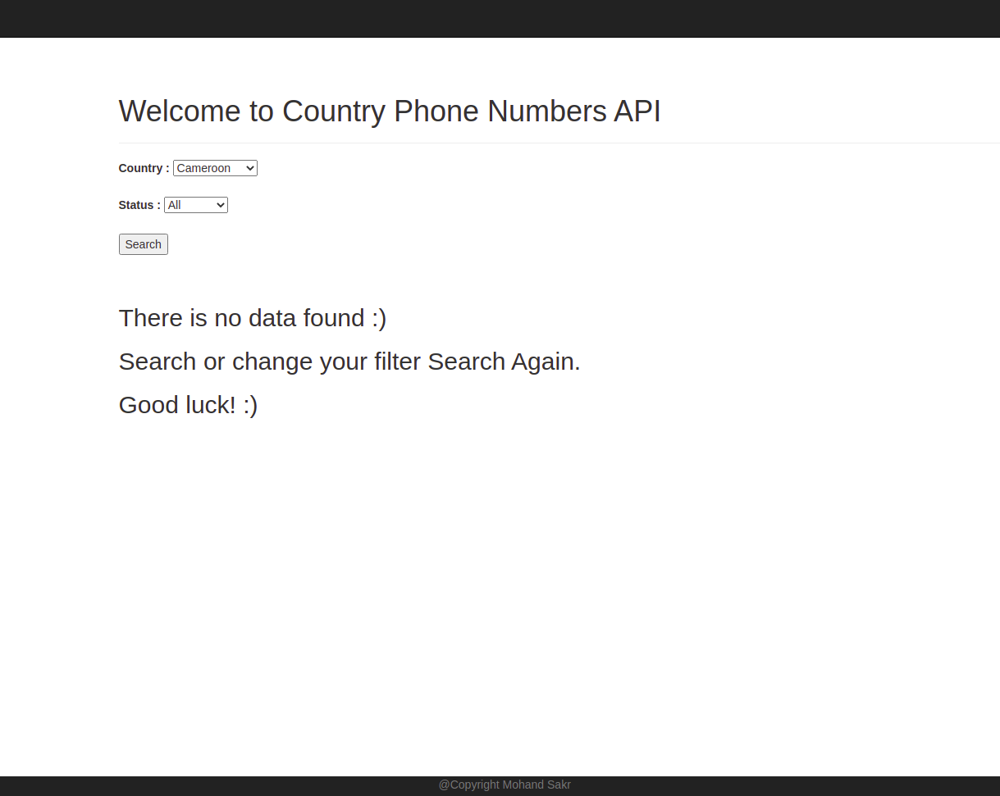
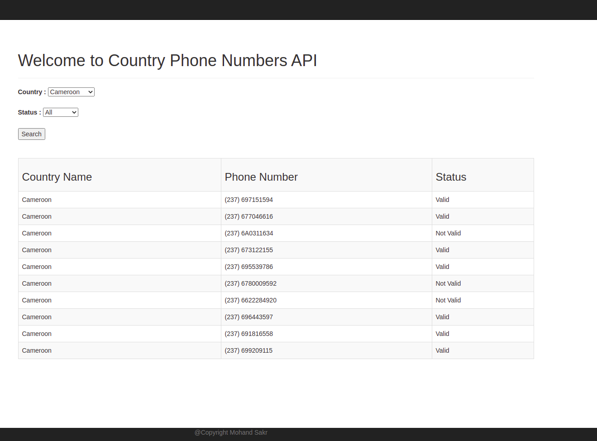
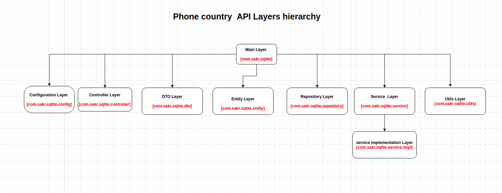

 
# Phone Country API :
##### Sections :   
  * ##### About 
  * ##### Assumsion 
  * ##### Code Architecture : 
    * ###### BackEnd Architecture.  
    * ###### FrontEnd Architecture. 
 * ##### Test archture.  
 * ##### How to build  and run.
 * ##### Dockrize home Country API.
---

#### Assumsion:
### About: 
 **It's a Sring-boot application with Thymeleaf** 
**using spring-data-jpa and sqlite3 database  . You can filter using countrey and phone status Valid or Not Valid**

 
### Code Architecture: 

### Test archture: 
** 
* **[Dockrize home Country Api .](https://medium.com./@wkrzywiec/how-to-put-your-java-application-into-docker-container-5e0a02acdd6b)**
    * *first build the project using maven* 
         > mvn clean install package 

    * *then go througth this [tutorial](https://medium.com./@wkrzywiec/how-to-put-your-java-application-into-docker-container-5e0a02acdd6b)* 

 

 
